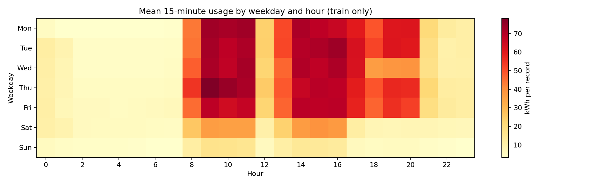

# Dự báo điện năng ngành thép — dữ liệu, mô hình và demo replay

## Phần Huy theo phân công Notion ngày 30/09/2026

Bản phân công mới xác định Duy phụ trách dữ liệu/mô hình, Khánh phụ trách calibration/đánh giá, Huy phụ trách demo/giám sát/an toàn/đóng gói. Các mục A/B/C phía dưới ghi lại công việc kỹ thuật trước đó, không thay thế phân công mới hoặc xác nhận nghiệm thu của nhóm.

Dashboard đã thêm **Đã xem / Đề nghị kiểm tra / Bỏ qua** với tên người ghi, ghi chú bắt buộc và nhật ký SQLite theo phiên. Đây là ghi nhận quan sát khi **chưa có policy cảnh báo đúng model**; không điều khiển thiết bị hoặc xác nhận tải an toàn.

Ghi nhận lưu ngữ cảnh dự báo tại thời điểm thao tác, chống gửi trùng, chặn ghi từ phiên/thời điểm cũ và không đưa actual tương lai vào nhật ký. Màn hình giám sát có thêm tỷ lệ yêu cầu dự báo bị lỗi lịch sử đầu vào. Tên người ghi là tự khai trong demo cục bộ, chưa có xác thực người dùng.

Kiểm tra cập nhật 01/10: 9 tests demo và 6 tests monitoring đạt; Edge kiểm luồng nhật ký, reload, actual trễ, đổi phiên, desktop/mobile và không có lỗi JavaScript. Bằng chứng cục bộ ở `reports/steel/modeling/huy_browser_20261001/`. Chưa kiểm trên máy vật lý khác. Chưa bổ sung báo cáo Word/PPT.

Bản này công bố **phần dữ liệu** của đồ án *Ứng dụng AI trong Công nghiệp*: kiểm tra dữ liệu gốc, phân tích 3B, tạo nhãn dự báo, tạo đặc trưng từ quá khứ, chia tập theo thời gian và trực quan hóa. Bài toán là dự báo **tổng kWh của 60 phút tiếp theo** tại một cơ sở thép để người quản lý năng lượng có thêm thông tin trước khi xem xét giờ tải cao.

**Nguồn:** [UCI Steel Industry Energy Consumption](https://archive.ics.uci.edu/dataset/851/steel+industry+energy+consumption), DOI [10.24432/C52G8C](https://doi.org/10.24432/C52G8C), giấy phép CC BY 4.0. Dữ liệu gốc gồm **35.040 bản ghi × 11 cột**, cách nhau 15 phút trong năm 2018. Bản CSV trong repo được giữ nguyên byte và kiểm tra SHA-256 trước khi xử lý.

## Chạy lại

Từ thư mục gốc repo với Python 3.12 trở lên:

```powershell
python -m venv .venv
.venv\Scripts\python -m pip install -r requirements.txt
.venv\Scripts\python -m scripts.prepare_steel_data
.venv\Scripts\python -m unittest discover -s tests -p test_steel_preprocessing.py -v
```

Trên Linux/macOS, thay `.venv\Scripts\python` bằng `.venv/bin/python`. Lệnh chuẩn bị dữ liệu tạo lại bốn CSV, JSON kiểm toán, bảng truy vết từng dòng, hồ sơ cột train và năm hình PNG. Không cần tải thêm dữ liệu vì bản CSV gốc đã có trong repo.

## Quy trình và kết quả

| Bước | Việc đã làm | Lý do |
| --- | --- | --- |
| Đọc nguồn | Kiểm tra hash, đúng 11 cột, parse `DD/MM/YYYY HH:MM` rồi sắp xếp thời gian. | File UCI đặt bản ghi `00:00` cuối ngày; có **365** lần thứ tự thời gian lùi. |
| Kiểm tra chất lượng | Kiểm tra đủ lưới 15 phút, không trùng mốc, giá trị hữu hạn/không âm và cột lịch khớp timestamp. | Tránh tạo lag hoặc nhãn sai khi nguồn bị hỏng. Sau sort có **0 ô thiếu, 0 mốc trùng, 0 khoảng gián đoạn**. |
| Tạo nhãn | `target_next_60m_kWh(t) = Usage(t+15m) + Usage(t+30m) + Usage(t+45m) + Usage(t+60m)`. | Đúng câu hỏi vận hành: điện năng cộng dồn trong một giờ tương lai; đơn vị **kWh**, không phải kW. |
| Tạo feature | 15 biến mặc định gồm lag, thống kê quá khứ và lịch biết trước. | Tại thời điểm `t`, không dùng bản đo sau `t` làm đầu vào. `CO2(tCO2)` và `Load_Type` không dùng mặc định vì chưa rõ thời điểm có sẵn và ý nghĩa vận hành. |
| Chia tập | Train tháng 1–8, validation tháng 9, calibration tháng 10, test tháng 11–12. | Không xáo trộn thời gian; loại các nhãn vượt qua ranh giới tập. |

| Tập | Số mốc dự báo |
| --- | ---: |
| Train | 22.652 |
| Validation | 2.876 |
| Calibration | 2.972 |
| Test | 5.852 |
| **Tổng dùng được** | **34.352** |

**688 mốc không dùng:** 672 mốc đầu chưa đủ lịch sử bảy ngày, 12 mốc có nhãn chạm qua ba ranh giới tập và 4 mốc cuối chưa có đủ bốn bản đo tương lai. Lý do của **toàn bộ 35.040 mốc** nằm trong [`steel_row_manifest.csv`](data/steel/processed/steel_row_manifest.csv).

### 3B và quyết định xử lý

- **Broken:** nguồn không thiếu ô/khoảng sau sắp xếp; lỗi cần xử lý là thứ tự thời gian. Pipeline dừng khi gặp nguồn thiếu hoặc mốc đo sai, không tự nội suy.
- **Bad Quality:** có một bản ghi `Usage_kWh = 0` và các đỉnh cao. Không có nhật ký cảm biến để xác định chúng là lỗi, nên giữ nguyên, không cắt p99.
- **Background:** không có dữ liệu máy, sản lượng, ca làm, biểu giá hay hành động điều khiển. Vì vậy dữ liệu này hỗ trợ nghiên cứu dự báo, **chưa chứng minh tiết kiệm điện thực tế**.

Không scale trong CSV đã xử lý. Khi huấn luyện mô hình cần scale, scaler phải **fit trên train** rồi áp dụng nguyên vẹn cho các tập sau. Bài toán hiện là hồi quy với 15 feature; chưa cần PCA hay cân bằng lớp bằng SMOTE.

## Biểu đồ khám phá dữ liệu

**Tất cả hình bên dưới chỉ dùng dữ liệu tháng 1–8 (train)** để không nhìn vào các giai đoạn dùng chọn/đánh giá mô hình:

| Hình | Giúp trả lời |
| --- | --- |
| [Tuần đầu](reports/steel/figures/steel_train_first_week.png) | Chuỗi 15 phút thay đổi trong một tuần như thế nào? |
| [Phân bố](reports/steel/figures/steel_train_distributions.png) | Bản đo 15 phút và nhãn 60 phút có đuôi cao ra sao? |
| [Thứ × giờ](reports/steel/figures/steel_train_hour_weekday.png) | Mức sử dụng trung bình khác nhau theo lịch không? |
| [Tổng theo ngày](reports/steel/figures/steel_train_daily_totals.png) | Mức sử dụng có thay đổi giữa các tháng không? |
| [Tương quan lag](reports/steel/figures/steel_train_lag_correlations.png) | Các mốc 15 phút, 1 giờ, 1 ngày, 1 tuần trước liên hệ với hiện tại thế nào? |



Trên train, median điện năng 15 phút là **4,75 kWh**, p95 **102,02 kWh**. Tương quan với bản đo trước 15 phút, 1 giờ, 1 ngày, 1 tuần lần lượt khoảng **0,91; 0,69; 0,61; 0,67**. Đây là mô tả dữ liệu, **không phải điểm số dự báo**. Bản chi tiết và cách diễn giải thận trọng nằm trong [báo cáo chuẩn bị dữ liệu](reports/steel/data_preparation.md).

## Tệp chính

```text
data/steel/raw/Steel_industry_data.csv       Nguồn UCI nguyên trạng
data/steel/processed/                     Bốn tập và tệp kiểm toán
src/steel/preprocessing.py                 Kiểm tra, tạo nhãn/feature, chia tập
src/steel/sequences.py                     Cửa sổ quá khứ cho thử nghiệm DL sau này
scripts/prepare_steel_data.py              Lệnh tạo dữ liệu và biểu đồ
reports/steel/figures/                     Năm biểu đồ train
reports/steel/data_preparation.md           Giải thích 3B, số liệu và mọi quyết định
docs/data/steel_data_dictionary.md         Từ điển cột và thời điểm có sẵn
tests/test_steel_preprocessing.py           Kiểm thử nhãn, rò rỉ, ranh giới và dữ liệu lỗi
```

Tham khảo phương pháp: [scikit-learn về data leakage và tiền xử lý nhất quán](https://scikit-learn.org/stable/common_pitfalls.html), [pandas `shift` cho lag](https://pandas.pydata.org/docs/reference/api/pandas.Series.shift.html). Những số liệu và hình trong repo được tính lại từ bản CSV UCI; chúng không phải kết quả do UCI công bố.

**Phạm vi giai đoạn dữ liệu đã công bố:** phần trên mô tả dữ liệu và EDA. Các phần bên dưới bổ sung so sánh mô hình và dashboard replay; chưa có kết luận hiệu quả công nghiệp.

## Phần A — baseline và hai mô hình theo bản phân công

Chạy ba baseline (tổng giờ vừa qua, cùng giờ ngày trước, cùng giờ tuần trước), Ridge với scaler fit trên train và HistGradientBoosting. Giữ 15 feature mặc định cùng target tổng kWh 60 phút; chỉ so sánh trên validation tháng 9. Không tạo dữ liệu giả, không dùng calibration/test để chọn mô hình, chưa tìm kiếm hyperparameter hoặc hiệu chỉnh cảnh báo.

```powershell
.venv\Scripts\python -m pip install -r requirements.txt
.venv\Scripts\python -m scripts.train_steel_models
.venv\Scripts\python -m unittest discover -s tests -p test_steel_modeling.py -v
```

Đầu ra nằm trong `reports/steel/modeling/initial_validation/`: cấu hình ghi trước khi fit, dự báo trên các mốc thật, bảng MAE/RMSE/bias, manifest phiên bản/hash và model card. Mỗi mô hình lưu thành `.joblib` trên máy, không đưa vào Git. Các cột dự báo là kết quả mô hình, không phải số đo mới. Chỉ nạp model từ nguồn tin cậy.

Lệnh không ghi đè một thư mục kết quả đã có. Để kiểm tra tái lập, dùng `--output-dir <thu_muc_moi>`. Thời gian đo là batch validation, không phải độ trễ toàn hệ thống. B cần kiểm tra chéo kết quả trước khi nhóm chốt mô hình và policy. Các tests mới chỉ dùng bản ghi thật; bộ tests tiền xử lý cũ có thêm các ca sửa bản sao dữ liệu để thử lỗi, không nằm trong nhóm kiểm tra chỉ dữ liệu thật này.

## Phần A tiếp theo — phân tích lỗi và tinh chỉnh có giới hạn

Tệp kết quả cục bộ `reports/steel/modeling/tuning_v1/technical_report.md` tổng hợp phương pháp, kết quả, lỗi tải cao và dự báo âm. [Cấu hình tìm kiếm](configs/steel_tuning_v1.json) cố định 5 Ridge + 8 HGB trước khi chạy; vẫn chỉ chọn bằng validation tháng 9, không đánh giá calibration/test. HGB được chọn có MAE 15,5984 kWh so với 15,8005 kWh ban đầu; còn dự báo thấp ở 92/93 mẫu tải cao nên chưa thể kết luận đạt yêu cầu cảnh báo công nghiệp.

```powershell
.venv\Scripts\python -m scripts.analyze_and_tune_steel --output-dir reports/steel/modeling/new_run
.venv\Scripts\python -m unittest discover -s tests -p test_steel_diagnostics.py -v
```

Kết quả kèm CSV từng dự báo/cấu hình, phân nhóm giờ/thứ/thay đổi phụ tải, danh sách lỗi lớn, phân rã Ridge, hình chẩn đoán và latency theo từng mẫu thật. Latency chỉ đo `model.predict`, không phải toàn hệ thống. Đây là lượt tuning dựa trên validation đã xem trước đó; cần B kiểm tra chéo trước khi nhóm chuyển giai đoạn. Không tiếp tục mở rộng tìm kiếm hoặc coi điểm validation là kết quả kiểm định độc lập.

## Chức năng dự báo để B kiểm tra và C tích hợp

`SteelForecaster` nhận lịch sử thật kết thúc tại thời điểm dự báo; tự tạo feature và trả tổng kWh 60 phút tới. Có CLI xuất JSON và lệnh phát lại toàn validation `python -m scripts.replay_steel`.

**Bản dùng để tích hợp là `inference_v1`.** Phát lại phát hiện sai khác dự báo do phép tính rolling và cửa sổ có sai số số học khác nhau. Đã thống nhất phép tính feature và fit lại một lần với đúng cấu hình HGB đã chọn. MAE bản đóng gói là **15,7150 kWh**, không phải 15,5984 kWh của bản tuning cũ; vẫn dự báo thấp ở 93/93 mẫu tải cao. Dữ liệu và kết quả trước đó được giữ nguyên.

```powershell
.venv\Scripts\python -m scripts.predict_steel --history-csv reports/steel/modeling/replay_v1/example_history.csv --issue-time 2018-09-01T00:00:00
.venv\Scripts\python -m unittest discover -s tests -p test_steel_inference.py -v
```

Model chỉ dùng cho kiểm tra/tích hợp cục bộ; chưa có policy cảnh báo hay kiểm định công nghiệp. Các model `.joblib` không nằm trong Git; làm theo mục tái tạo dưới đây khi clone trên máy khác.

## Tái tạo model và chạy demo từ bản clone mới

Các kết quả trong `reports/steel/modeling/` được tạo cục bộ và không đi kèm commit source code. Dữ liệu raw/processed đã nằm trong repo. Với Python 3.12, chạy lần lượt tại thư mục gốc:

```powershell
python -m venv .venv
.venv\Scripts\python -m pip install -r requirements.txt
.venv\Scripts\python -m scripts.train_steel_models
.venv\Scripts\python -m scripts.analyze_and_tune_steel
.venv\Scripts\python -m scripts.package_steel_model
.venv\Scripts\python -m scripts.check_steel_demo_environment
.venv\Scripts\python -m scripts.serve_steel_demo
```

Mở `http://127.0.0.1:8765`. Ba lệnh train/tune/package chỉ cần chạy khi chưa có kết quả; chúng từ chối ghi đè thư mục đã có. Nếu tái tạo lần nữa, dùng các thư mục mới qua `--output-dir`; truyền thư mục tuning vào `package_steel_model --original-run`, rồi truyền thư mục model mới vào `serve_steel_demo --model-dir`. Lệnh kiểm môi trường mặc định kiểm `inference_v1`.

Đầu vào inference gồm ít nhất 673 bản đo thật liên tiếp, hai cột `observation_time` và `Usage_kWh`, nhịp 15 phút, không trùng/thiếu/âm, bản cuối đúng thời điểm dự báo. Actual chỉ được chấm khi đủ bốn bản đo tương lai đã tới đồng hồ replay. Không tự nội suy hoặc chuyển sang baseline khi dữ liệu lỗi.

Để tạo ví dụ lịch sử và kiểm tra replay theo model vừa đóng gói:

```powershell
.venv\Scripts\python -m scripts.replay_steel
.venv\Scripts\python -m scripts.predict_steel --history-csv reports/steel/modeling/replay_v1/example_history.csv --issue-time 2018-09-01T00:00:00
```

Chạy các kiểm thử code mới sau khi đã tạo model; các ca cần artifact sẽ bị bỏ qua nếu chưa đóng gói:

```powershell
.venv\Scripts\python -m unittest discover -s tests -p test_steel_modeling.py -v
.venv\Scripts\python -m unittest discover -s tests -p test_steel_diagnostics.py -v
.venv\Scripts\python -m unittest discover -s tests -p test_steel_inference.py -v
.venv\Scripts\python -m unittest discover -s tests -p test_steel_monitoring.py -v
.venv\Scripts\python -m unittest discover -s tests -p test_steel_demo.py -v
```

## Theo dõi dự báo và lỗi — phần kỹ thuật cổng 11

`src/steel/monitoring.py` bổ sung `ForecastMonitor`, bọc chức năng dự báo hiện tại và lưu SQLite trên máy. Mỗi yêu cầu có trạng thái, lý do lỗi, thời gian xử lý và model tương ứng. Đầu ra lỗi có `prediction=null`, không thay bằng 0 kWh hoặc tự chuyển sang baseline.

| Trạng thái | Ý nghĩa cho giao diện |
|---|---|
| `forecast_ready` | Có dự báo; không đồng nghĩa với tải an toàn |
| `invalid_history` | Lịch sử không đáp ứng điều kiện, cần kiểm đầu vào |
| `model_unavailable` | Không nạp được model, không cung cấp dự báo |
| `prediction_failed` | Model không thực hiện được dự báo hợp lệ |
| `forecast_conflict` | Đã có dự báo khác cho cùng mốc/model; không ghi đè |
| `invalid_actual_history` | Nhật ký ghi việc từ chối dữ liệu đối chiếu không hợp lệ |

`observe(history, as_of)` chỉ nhận số đo thật đã có tại `as_of`; không được truyền cả CSV tương lai. Chỉ khi đã qua `forecast_end` và có đủ bốn bản đo mới lưu actual và tính sai số. Thiếu bản đo thì tiếp tục chờ, không nội suy. Actual đã ghi không bị thay đổi khi chạy lại; sửa dữ liệu cần một lần chạy riêng được kiểm tra. `snapshot(as_of)` trả MAE/bias trên các nhãn đã ghi nhận tới mốc đó và cửa sổ 24 giờ theo `forecast_end`, tách riêng từng hash model. Cửa sổ 24 giờ chỉ để theo dõi, không phải ngưỡng cảnh báo. `request_counts_all_logged` là tổng nhật ký hiện lưu trong database, không phải truy vấn lịch sử tại `as_of`.

```powershell
.venv\Scripts\python -m unittest discover -s tests -p test_steel_monitoring.py -v
.venv\Scripts\python -m scripts.run_monitored_replay --output-dir reports/steel/modeling/monitoring_new_run
```

Lượt chạy thật hiện tại nằm trong `reports/steel/modeling/monitoring_v1/`: database cục bộ, CSV các dự báo đã đủ actual, snapshot theo ngày và JSON ghi kết quả/hash. Đây là log chạy chương trình, không phải file báo cáo hoặc slide. SQLite được Git bỏ qua; CSV/JSON dùng để đối chiếu kết quả. Lệnh replay chỉ dùng lịch sử và validation tháng 9; không fit lại model, chạy calibration/test hoặc sinh giá trị đo giả.

```python
from pathlib import Path
from src.steel.monitoring import ForecastMonitor

# history là DataFrame bản đo thật đã có tại issue_time.
with ForecastMonitor(Path("reports/steel/modeling/inference_v1"),
                     Path("reports/steel/modeling/local_session/monitor.sqlite3")) as service:
    response = service.forecast(history, issue_time)
    # Khi thời gian đã tiến lên, truyền thêm các bản đo thật đã tới.
    service.observe(observed_history, as_of)
    metrics = service.snapshot(as_of)
```

Model HGB `inference_v1` vẫn là bản tích hợp cục bộ đang dùng. Notebook LightGBM vừa pull có quy trình cảnh báo/calibration/test riêng; chưa đưa model, ngưỡng hoặc điểm số của notebook đó vào monitor này. Chưa có trigger drift, retrain tự động hoặc cảnh báo tải cao; giao diện theo dõi được bổ sung ở mục tiếp theo. Luồng hiện tại chạy tuần tự và chưa kiểm thử như dịch vụ nhiều người dùng.

## Giao diện demo replay — phần Huy có thể triển khai độc lập

Dashboard cục bộ đã có: chọn mốc tháng 9, chạy/dừng/từng bước 15 phút, biểu đồ điện năng đã đo, dự báo tổng 60 phút tới, bảng actual sau khi đủ nhãn, MAE/bias 24 giờ, trạng thái lỗi và tài nguyên tiến trình. Mỗi lần “Mở phiên mới” tạo database riêng; không mang actual của phiên trước về một mốc quá khứ. Ở cuối tháng, bốn bước cuối chỉ chốt nhãn, không tạo dự báo vượt phạm vi validation. Có nhật ký ghi nhận của người quan sát như mô tả ở đầu README; chưa tích hợp cảnh báo hoặc hành động vận hành.

Chạy từ gốc repo:

```powershell
.venv\Scripts\python -m scripts.check_steel_demo_environment
.venv\Scripts\python -m scripts.serve_steel_demo
```

Mở **http://127.0.0.1:8765**. Dừng server bằng Ctrl+C. Có thể dùng `--port 8766` khi cổng mặc định đang bận. PowerShell cũng có lệnh `& .\scripts\start_steel_demo.ps1` để kiểm tra rồi khởi động; nếu chính sách máy chặn script PowerShell, dùng hai lệnh Python trên, không cần đổi chính sách máy.

Ứng dụng dùng Python HTTPServer + HTML/CSS/JavaScript, không cần Node, Streamlit, dịch vụ ngoài hoặc mạng để hiển thị. Server chỉ bind loopback, xử lý tuần tự và có **một phiên demo chung trên mỗi server**; không dùng chung server này để nhiều người điều khiển đồng thời. Thay đổi giờ là mở phiên mới, không sửa nhật ký cũ. Database nằm trong `reports/steel/modeling/demo_sessions/`, được Git bỏ qua. Chưa có tự dọn log; mỗi phiên mới giữ lại một database.

Số liệu tài nguyên trên màn hình gồm thời gian backend, CPU tiến trình mỗi thao tác (ms, không phải %), RAM working set hiện tại, kích thước model và thời gian từ gửi yêu cầu đến cập nhật trang. p95 trong phiên gồm cả lần mở phiên/nạp model. Đây là đo cục bộ, không đại diện cho độ trễ cảm biến/mạng nhà máy hoặc nhiều người dùng.

Kiểm thử bằng bản ghi thật:

```powershell
.venv\Scripts\python -m unittest discover -s tests -p test_steel_demo.py -v
```

Tùy chọn kiểm tra tự động trên Edge đã cài sẵn (chỉ môi trường kiểm tra cần Playwright; server cần được chạy trước):

```powershell
python -m venv .venv-demo-check
.venv-demo-check\Scripts\python -m pip install -r requirements.txt -r requirements-ui-test.txt
.venv-demo-check\Scripts\python -m scripts.check_steel_demo_browser --output-dir reports/steel/modeling/browser_new_check
```

Lượt kiểm tra hiện tại lưu screenshot desktop/mobile, số đo 24 bước và JSON kết quả tại `reports/steel/modeling/demo_browser_v1/`. Không có báo cáo Word/PDF/PPT mới. Model tái tạo trong môi trường Python sạch trên **cùng máy**, ở `clean_environment_inference`, có hash và dự báo khớp bản dùng trước đó; đây chưa phải xác nhận đã thử trên một máy vật lý khác.
