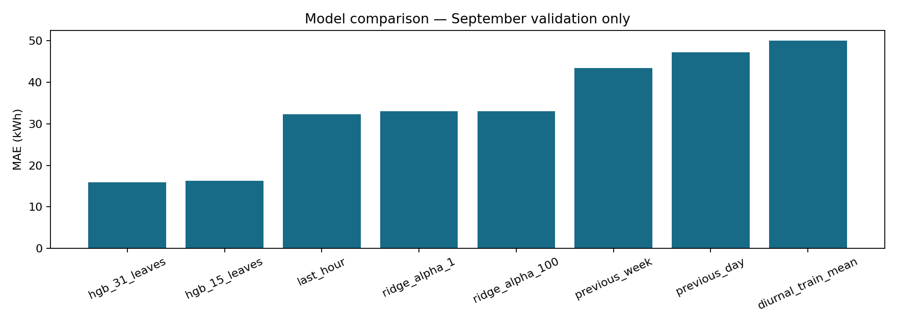
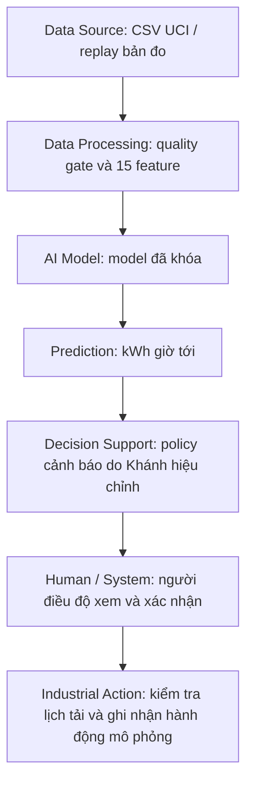

# Dự báo điện năng ngành thép — đồ án AI trong Công nghiệp

**Nhóm:** Duy (problem, dữ liệu, baseline/model) · Khánh (QA, calibration/evaluation) · Huy (demo, monitoring, tài liệu nộp).

**Mục tiêu:** dự báo tổng **kWh của 60 phút tiếp theo** tại cơ sở thép, sau đó hỗ trợ người điều độ xem xét các khoảng tiêu thụ cao. Mỗi bản đo cách nhau 15 phút. Kiến trúc và phân công theo [kế hoạch A–Z](docs/team/ke_hoach_nhom_3_nguoi.md) và [Notion nhóm](https://app.notion.com/p/3eb7c2776902811896b1d75c0f11cf82?pvs=204).

**Bản hiện tại ngày 02/10/2026:** chạy được dữ liệu → feature → baseline/model → dự báo; có biểu đồ, QA, kiểm thử, model bàn giao và dashboard replay đã nối model. Calibration/test mới và policy cảnh báo chưa nghiệm thu. [Chi tiết rà soát và việc nhóm cần làm](docs/team/review_and_release_2026-10-02.md).

## 1. Bắt đầu từ đâu?

| Cần đọc/làm | Tệp |
|---|---|
| Chốt bài toán, người dùng, quyết định và ràng buộc | [Problem card của Duy](docs/team/duy_problem_card.md) |
| Biết việc của ba người từ đầu đến khi nộp | [Kế hoạch A–Z](docs/team/ke_hoach_nhom_3_nguoi.md) |
| Hiểu code, kết quả và tài liệu cần học | [Hướng dẫn phần Duy](docs/team/duy_implementation_and_learning.md) |
| Đọc dữ liệu và xem hình từng bước | [Notebook 03 của Duy](notebooks/03_duy_steel_data_and_models.ipynb) |
| Calibration/evaluation đúng model đã khóa | [Notebook 02 của Khánh](notebooks/02_steel_modeling_evaluation.ipynb), hiện cần sửa xung đột merge trước khi chạy |
| Xem các lỗi đã sửa và việc còn thiếu | [Rà soát 02/10](docs/team/review_and_release_2026-10-02.md) |

## 2. Chạy trên máy cá nhân

Mở terminal tại thư mục gốc repo. **Demo HGB dùng `requirements-demo.txt`**, đã kiểm trên máy Huy với Python 3.12.6; model Duy được tạo bằng Python 3.14.3 và yêu cầu **scikit-learn 1.8.0**. `requirements.txt` hiện dành cho luồng nghiên cứu LightGBM, có ràng buộc NumPy khác; dùng môi trường riêng, không cài đè vào môi trường demo.

```powershell
python -m venv .venv
.venv\Scripts\python -m pip install -r requirements-demo.txt
.venv\Scripts\python -m scripts.check_steel_demo_environment
.venv\Scripts\python -m unittest tests.test_steel_modeling tests.test_steel_diagnostics tests.test_steel_inference tests.test_steel_monitoring tests.test_steel_demo tests.test_steel_policy tests.test_steel_demo_environment -v
.venv\Scripts\python -m scripts.check_duy_handoff --run-dir reports/steel/duy_2026-10-02
.venv\Scripts\python -m scripts.predict_duy_steel --run-dir reports/steel/duy_2026-10-02 --issue-time 2018-09-01T08:00:00
```

Linux/macOS dùng `.venv/bin/python`. Bản CSV UCI và model bàn giao đã có trong repo. Chỉ nạp joblib của nguồn nhóm tin cậy; checksum kiểm tính toàn vẹn của file.

Để huấn luyện lại cùng cấu hình, chọn **thư mục kết quả chưa tồn tại**:

```powershell
.venv\Scripts\python -m scripts.run_duy_pipeline --output-dir reports/steel/duy_reproduction_01
.venv\Scripts\python -m scripts.audit_features_and_leakage --processed-dir reports/steel/duy_reproduction_01/processed
.venv\Scripts\python -m scripts.check_duy_handoff --run-dir reports/steel/duy_reproduction_01
```

Script không ghi đè lần chạy trước. Có thể tải repo dạng ZIP; khi không có `.git`, metadata ghi commit là `null`.

Notebook/nghiên cứu: tạo môi trường riêng, cài `requirements-notebooks.txt` hoặc `requirements-khanh.txt` và chọn kernel tương ứng. Hai file này kéo theo `requirements.txt` của luồng nghiên cứu. Ngày 08/10 phát hiện notebook 02 trên bản merge `f6222c7` còn 8 khối xung đột Git; cần Duy/Khánh giải quyết trước khi dùng notebook đó để tái tạo calibration/test.

## Demo của nhóm đã tích hợp

Code demo/monitoring mới nhận từ commit nhóm `12eed4b` được giữ đầy đủ và nối trực tiếp với model Duy, không fit lại hay dùng buffer LightGBM.

```powershell
.venv\Scripts\python -m scripts.check_steel_demo_environment
.venv\Scripts\python -X utf8 -m scripts.serve_steel_demo --port 8765
```

Mở **http://127.0.0.1:8765**. Chọn mốc tháng 9 → mở phiên → tiến từng bước 15 phút → xem dự báo, actual sau đủ 60 phút, MAE/bias và nhật ký người xem. Chưa bật policy cảnh báo; UI ghi rõ trạng thái này. Mỗi phiên có SQLite riêng trong `reports/steel/modeling/demo_sessions`, không đưa log cá nhân vào Git.

- UI HTML/CSS/JavaScript, backend Python chuẩn; không cần Streamlit hoặc Node.
- Demo bind loopback và chạy tuần tự, một phiên chung trên mỗi server. Dừng bằng Ctrl+C.
- Bản tích hợp 02/10 ghi nhận 62/62 unittest đạt, không skip, trên máy Duy; bằng chứng lịch sử ở liên kết bên dưới. Khánh cần kiểm chéo trên máy mình.
- Kiểm phần Huy ngày 06/10/2026 trên Windows/Python 3.12.6: 32 kiểm thử modeling/diagnostics/inference/monitoring/demo đạt; kiểm bàn giao nguồn/model và đối chiếu offline–online đạt. Edge kiểm luồng replay, ba thao tác ghi nhận, actual trễ, qua nửa đêm và desktop/mobile. Đây là kiểm cục bộ, chưa nghiệm thu policy cảnh báo.
- UI đọc tên/hash và MAE/RMSE validation từ model đã nạp. Khi đủ giờ nhưng thiếu bản đo, actual vẫn trống. Lỗi model vẫn cho ghi đề nghị kiểm tra/bỏ qua; không cho xác nhận dự báo.
- Các lệnh train/tune/package cũ và source được giữ để đối chiếu; [README upstream lịch sử](docs/team/upstream_demo_12eed4b.md) mô tả artifact `inference_v1` riêng. Luồng mặc định ở README này dùng `duy_2026-10-02`.

[Bằng chứng kiểm thử và ảnh demo](reports/steel/duy_2026-10-02/release_verification.json) · [Ảnh desktop](reports/steel/duy_2026-10-02/demo_browser_check/desktop.png) · [Ảnh mobile](reports/steel/duy_2026-10-02/demo_browser_check/mobile.png).

Kiểm riêng bốn ca lỗi bằng Edge đã cài trên máy (thiếu model, sai checksum bản sao model, thiếu bản đo đầu vào, đủ giờ nhưng thiếu bản đo actual):

```powershell
.venv\Scripts\python -m pip install -r requirements-ui-test.txt
.venv\Scripts\python -m scripts.check_steel_demo_failures --output-dir reports/steel/modeling/failure_check_new
```

Lệnh tự mở server QA tạm, không thay CSV/model gốc. Chọn thư mục kết quả mới; nhật ký/ảnh kiểm tra nằm ngoài phần được Git theo dõi. Trên máy Huy, môi trường tương thích đã cài là `.venv-huy-check`; thay `.venv` trong lệnh nếu dùng môi trường đó.

## Tiếp nhận policy trên demo — 08/10/2026

Demo đọc `notebooks/artifacts/policy.json` khi mở phiên. Bộ kiểm tra đọc JSON, version, schema, ngưỡng/buffer, quy tắc và hash artifact; đối chiếu với hash model thực sự đã nạp. Không thực thi chuỗi lệnh trong JSON, không áp dụng fallback hay buffer.

- `missing`: chưa có file; `invalid`: cấu trúc/artifact chưa hợp lệ; `incompatible`: khác model hoặc schema; `model_unavailable`: chưa nạp được model để đối chiếu.
- `verified_inactive`: cấu trúc và định danh khớp, **chưa xác nhận calibration hoặc bật cảnh báo**. Bản này luôn trả `alerts_enabled=false`.
- Policy được chụp lại trong SQLite lúc mở phiên và gắn vào mỗi ghi nhận; mở lại database giữ kết quả cũ, mở phiên mới mới đọc file cập nhật.
- Với bàn giao hiện tại: policy dành cho LightGBM, demo chạy HGB; đồng thời hash LightGBM trong policy khác artifact trong repo. UI hiển thị cả hai lý do. Không đổi hash/buffer chỉ để vượt kiểm tra.

Kiểm môi trường mặc định dùng `requirements-demo.txt`. Để kiểm riêng môi trường nghiên cứu, chạy `python -m scripts.check_steel_demo_environment --requirements requirements.txt`; các điều kiện `>=`, `<`, `<=`, `==` và file `-r` đều được kiểm, thiếu/sai gói trả mã lỗi 1. Kết quả READY chỉ xác nhận luồng replay, không xác nhận cảnh báo.

Checklist trước khi nối cảnh báo:

- [ ] Duy chốt model cuối và bàn giao artifact, feature implementation cùng lệnh inference.
- [ ] Khánh bàn giao policy khớp model, số liệu calibration đủ độ chính xác và cách tái tạo.
- [ ] Nhóm chốt điều kiện fallback, giới hạn cảm biến, thuật toán ghép episode và trigger giám sát.
- [ ] Duy/Khánh sửa notebook merge và thống nhất số liệu Notion với artifact.
- [ ] Huy mới triển khai cảnh báo và kiểm chéo các ca thật; không tự đổi model hoặc hiệu chỉnh lại trên test.

## 3. Dữ liệu và tiền xử lý

**Nguồn:** [UCI Steel Industry Energy Consumption](https://archive.ics.uci.edu/dataset/851/steel+industry+energy+consumption), [DOI 10.24432/C52G8C](https://doi.org/10.24432/C52G8C), **CC BY 4.0**. Nguồn gồm **35.040 hàng × 11 cột**, năm 2018. CSV nguyên byte có SHA-256:

```text
9b1cee6f9cb9cd9df2b95814ca90a9a2ff15b7f5f1fba0fae3c643e82072eacc
```

| Yêu cầu dữ liệu | Quyết định và lý do |
|---|---|
| Broken | Raw có 365 lần timestamp lùi; parse ngày khai báo, sort, kiểm đủ lưới 15 phút. Sau sort: không gap, trùng hoặc ô thiếu. Không tự sửa ngày 00:00. |
| Bad Quality | Giữ một giá trị zero và đỉnh tải vì thiếu bằng chứng sensor lỗi. Không cắt p99; chặn NaN/Inf/âm và timestamp lỗi. |
| Background | Thiếu lịch ca, sản lượng, máy, TOU, hợp đồng, BESS và hành động thật. Phạm vi là nghiên cứu dự báo và hỗ trợ kiểm tra. |
| Missing/outliers | Không nội suy nguồn sạch; không tự điền lịch sử mất khi inference. Model yêu cầu đủ 673 bản đo. |
| Target | `Usage(t+1)+Usage(t+2)+Usage(t+3)+Usage(t+4)`; mỗi bước 15 phút. |
| Features | 15 biến Usage quá khứ và lịch biết trước; `lag_0` hợp lệ sau khi bản đo t hoàn tất. CO2/Load_Type không là input mặc định; sensor optional chỉ lưu để đối chiếu. |
| Scaling | CSV giữ đơn vị gốc. Ridge dùng `Pipeline(StandardScaler, Ridge)` fit trên train; HGB không cần scaler. |
| Feature selection/PCA/imbalance | Chọn 15 biến theo khả năng có sẵn và ý nghĩa thời gian. Chưa cần PCA, SMOTE hoặc deep learning để đáp ứng bài toán hồi quy hiện tại. |

**Giả định timestamp:** bản đo tại t đã hoàn tất và có sẵn khi phát dự báo. UCI chưa xác nhận rõ quy ước đầu/cuối khoảng đo; cần xác nhận trước dùng vận hành thật.

| Tập | Giai đoạn | Số mốc dùng được | Công dụng |
|---|---|---:|---|
| Train | Tháng 1–8 | 22.652 | Fit model/scaler/baseline theo lịch |
| Validation | Tháng 9 | 2.876 | Chọn model và xem ca sai |
| Calibration | Tháng 10 | 2.972 | Khánh hiệu chỉnh buffer sau khi khóa model |
| Test | Tháng 11–12 | 5.852 | Đánh giá model/policy đã khóa |

Tổng dùng **34.352**, loại **688**: 672 chưa đủ lag tuần, 12 nhãn chạm qua ranh giới và 4 cuối năm thiếu nhãn tương lai. Manifest giải thích từng hàng. Test đã được xem trong lịch sử; không mô tả lần đánh giá sau là test mù.

**Hai phiên bản feature:** dữ liệu `data/steel/processed` giữ pipeline pandas trước đây để đối chiếu. Lần model mới dùng `reports/steel/duy_2026-10-02/processed`, metadata `duy_numpy_windows_v1`; rolling tính từng cửa sổ NumPy để batch/replay khớp số học. Không trộn các processed/model khác phiên bản.

## 4. So sánh phương pháp và kết quả validation

Train tháng 1–8, chọn trên MAE tháng 9; so sánh cả bốn baseline và bốn cấu hình AI. Nếu bằng MAE, ưu tiên baseline. Không chọn model bằng test.

| Phương pháp | MAE kWh | RMSE kWh |
|---|---:|---:|
| **HGB, 31 lá** | **15,8829** | **32,0475** |
| HGB, 15 lá | 16,3177 | 32,5934 |
| Giờ gần nhất | 32,3238 | 69,1155 |
| Ridge, alpha=1 | 33,0168 | 50,9669 |
| Ridge, alpha=100 | 33,0307 | 51,0115 |
| Cùng giờ tuần trước | 43,4543 | 81,9046 |
| Cùng giờ ngày trước | 47,2319 | 91,0016 |
| Trung bình thứ/giờ, học train | 49,9719 | 78,6894 |

MAE HGB giảm **50,86%** so với baseline tốt nhất trên validation. Vùng cao có **93 mẫu**, MAE **68,6963 kWh**; dự báo điểm chưa đủ để khẳng định cảnh báo an toàn. [Bảng số, ca sai, protocol và model handoff](reports/steel/duy_2026-10-02/RESULTS.md).

**Trực quan:** bảy hình train và ba hình validation trong [thư mục figures](reports/steel/duy_2026-10-02/figures). EDA train không dùng các tập về sau; hình validation dùng riêng để chẩn đoán dự báo.



## 5. Đối chiếu yêu cầu thầy và kiến trúc



| Lifecycle/yêu cầu | Bằng chứng trong repo | Việc tiếp theo |
|---|---|---|
| Problem Definition | Problem card: vấn đề, mục tiêu, người dùng, quyết định, ràng buộc | Nhóm kiểm chéo nghiệp vụ |
| Data Understanding | Dictionary, 3B, audit và hình EDA | Xác nhận thêm context/timestamp nếu có nguồn |
| Data Preparation | Target/lag/rolling, temporal split, manifest, QA | Khánh nghiệm thu metadata và causality |
| Method Selection | Baseline, Ridge và HGB | Lựa chọn đã ghi protocol |
| Model Development | Pipeline, cấu hình, validation, model hash, 31 mốc replay | Khánh kiểm chéo artifact |
| Evaluation ba mức | Validation model-level; công cụ row/episode metrics | Khánh chạy calibration/test có kiểm soát, robustness; giá trị công nghiệp là kịch bản có giả định |
| Deployment | API và lệnh dự báo thật từ lịch sử | UI replay và nhật ký người xem đã có; Huy tích hợp policy và nghiệm thu nghiệp vụ |
| Monitoring/Improvement | Yêu cầu cụ thể trong kế hoạch/review | Đã log chất lượng, nhãn trễ và residual; Huy bổ sung drift và quy trình cải tiến |
| Reliability/Safety/Ethics | Ca sai, giới hạn dữ liệu, từ chối input lỗi, HITL trong problem card | Huy/Khánh kiểm tình huống lỗi trước nghiệm thu demo |

Dữ liệu hiện chưa cho phép chứng minh giảm tiền điện, tránh phạt công suất, giảm downtime hoặc tăng năng suất. Bản hiện chưa có cảnh báo tích hợp hoàn chỉnh; API trả `forecast_only_no_alert_policy`.

## 6. Thư mục chính

```text
src/steel/preprocessing.py       Kiểm nguồn, target, split và manifest
src/steel/duy_forecasting.py     Feature batch/replay, baseline, Ridge/HGB
src/steel/duy_inference.py       Nạp artifact đúng hash/schema và dự báo
src/steel/evaluation.py          Buffer, row metrics, episode overlap
scripts/                        Các lệnh prepare, QA, train, predict, check
notebooks/                      Notebook dữ liệu, Duy và Khánh
notebooks/archive/              Notebook LightGBM trước sửa
notebooks/artifacts/            Artifact LightGBM lịch sử, không dùng với HGB
data/steel/                     CSV UCI và processed trước đây
reports/steel/duy_2026-10-02/    Run bàn giao mới: hình, bảng, CSV và model
docs/team/                      Problem card, phân công, decision log, review
tests/                          Kiểm thử dữ liệu/model/QA/evaluation/demo/monitoring
```

## 7. Nguồn tham khảo

- [UCI Steel](https://archive.ics.uci.edu/dataset/851/steel+industry+energy+consumption): dữ liệu, metadata và giấy phép; số liệu audit/model là nhóm tính lại.
- [Jay Lee — Industrial AI (2020)](https://doi.org/10.1007/978-981-15-2144-7): 3B, bối cảnh vận hành, kết nối AI với quyết định; đối chiếu chương/trang trong kế hoạch A–Z và hướng dẫn Duy.
- [scikit-learn 1.8 — Common pitfalls](https://scikit-learn.org/1.8/common_pitfalls.html): leakage và fit preprocessing trên train.
- [Lagged features for forecasting](https://scikit-learn.org/1.8/auto_examples/applications/plot_time_series_lagged_features.html): feature thời gian và temporal evaluation.
- [Ridge](https://scikit-learn.org/1.8/modules/generated/sklearn.linear_model.Ridge.html), [HGB](https://scikit-learn.org/1.8/modules/generated/sklearn.ensemble.HistGradientBoostingRegressor.html), [RMSE API](https://scikit-learn.org/1.8/modules/generated/sklearn.metrics.root_mean_squared_error.html): lựa chọn và API theo phiên bản.

Báo cáo tám chương, source+demo và slide vẫn là sản phẩm cuối theo rubric; trạng thái từng phần nằm trong bảng và kế hoạch. Word chọn hướng có sẵn là tài liệu thảo luận lịch sử, không phải báo cáo hoàn thiện của lần chạy này.
