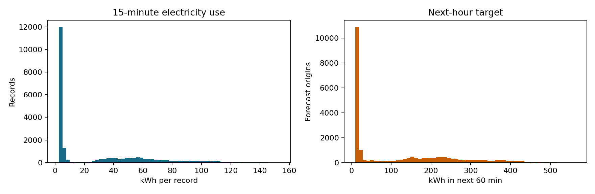
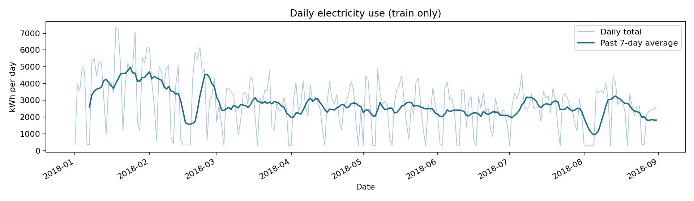
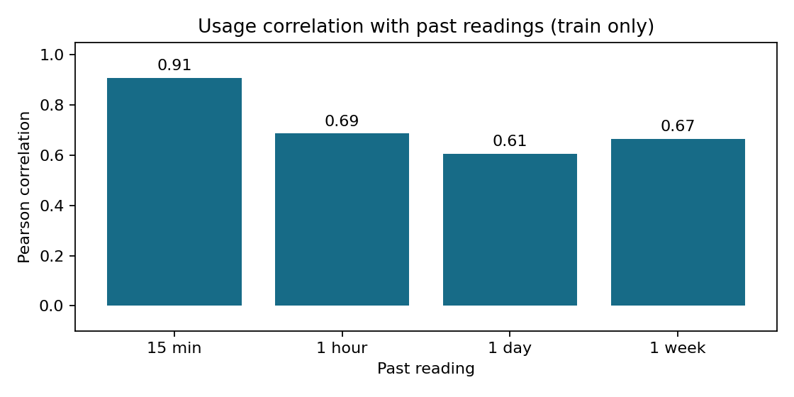

# Báo cáo đã thực hiện — xử lý dữ liệu UCI Steel

**Cập nhật giai đoạn dữ liệu:** 27/09/2026

**Phạm vi bản công bố này:** dữ liệu, kiểm tra chất lượng, nhãn, đặc trưng, chia tập và EDA. Không công bố kết quả huấn luyện hoặc hiệu quả vận hành trong phần này.
**Nguồn:** [UCI Steel Industry Energy Consumption](https://archive.ics.uci.edu/dataset/851/steel+industry+energy+consumption), DOI `10.24432/C52G8C`, CC BY 4.0.

Tài liệu này chốt kết quả **riêng của giai đoạn chuẩn bị dữ liệu**.

Hai bản `DoAn-AI-Cong-Nghiep-Du-Bao-Nang-Luong.md` và `Cong_Viec_Buoi_1_ChiTiet.md` là **kế hoạch nháp do nhóm cung cấp**, không phải yêu cầu mới của giảng viên. Phần đã áp dụng: lifecycle và 3B, rà dữ liệu gốc, EDA, định nghĩa horizon, chống rò rỉ, chia tập theo thời gian và chuẩn bị cho so sánh ML/DL. Các ví dụ trong bản nháp về nhiệt độ, HVAC, BESS, giá TOU và “tiền đã tiết kiệm” không phù hợp với các cột đang có của UCI Steel, nên chưa được đưa vào xử lý hoặc kết luận.

## 1. Đã làm gì?

1. Giữ nguyên CSV chính thức trong `data/steel/raw/Steel_industry_data.csv`; kiểm SHA-256 trước khi xử lý.
2. Đọc đúng định dạng thời gian `%d/%m/%Y %H:%M` và **sắp xếp theo timestamp**. File gốc đặt `00:00` ở cuối mỗi ngày nên thứ tự dòng gốc không phù hợp cho `shift`/rolling.
3. Thiết lập quality gate: schema 11 cột, timestamp không trùng và cách đều 15 phút, số liệu hữu hạn, điện năng không âm, hệ số công suất trong [0,100], `NSM`/thứ/ngày thường khớp timestamp.
4. Tạo nhãn `target_next_60m_kWh` bằng tổng bốn `Usage_kWh` ở `t+1…t+4` và ghi rõ `observation_time`, `forecast_start`, `forecast_end`.
5. Tạo feature ML từ quá khứ: lag 0/1/4/96/672, rolling 1/4/24 giờ và lịch tương lai đã biết. Bốn biến điện tại `t` được giữ ở nhóm **tùy chọn** để kiểm tra thêm; `CO2(tCO2)` và `Load_Type` không nằm trong feature mặc định.
6. Chia train / validation / calibration / test theo tháng, bỏ các dòng thiếu lịch sử tuần và các nhãn chạm sang tập sau. Không xáo trộn dữ liệu, không fit scaler trên toàn bộ năm.
7. Tạo `SteelSequenceView` để mô hình deep learning sau này đọc cửa sổ quá khứ trên **cùng mốc dự báo/cùng nhãn** với ML dạng bảng. Không tạo các mảng lớn trùng lặp trên đĩa.
8. Xuất 4 CSV đã xử lý, JSON provenance/chất lượng, bảng truy vết **mọi dòng** và hồ sơ 11 cột **chỉ từ giai đoạn train**; tạo 5 biểu đồ EDA train và kiểm thử nhãn, leak, split, sequence view, dữ liệu lỗi.

## 2. Kết quả kiểm tra dữ liệu gốc

| Kiểm tra | Kết quả |
| --- | ---: |
| Kích thước CSV | 35.040 dòng, 11 cột, 2.731.389 byte |
| SHA-256 | `9B1CEE6F9CB9CD9DF2B95814CA90A9A2FF15B7F5F1FBA0FAE3C643E82072EACC` |
| Khoảng thời gian sau sort | `2018-01-01 00:00` → `2018-12-31 23:45` |
| Khoảng cách sau sort | 35.039 khoảng × 15 phút; 0 khoảng bất thường |
| Thứ tự file gốc | Không tăng dần; 365 lần timestamp lùi, tương ứng bản ghi `00:00` cuối ngày |
| Ô thiếu / timestamp trùng / điện năng âm | 0 / 0 / 0 |
| Điện năng bằng 0 | 1 bản ghi; giữ lại, không tự coi là lỗi |

Trong **giai đoạn train tháng 1–8**, `Usage_kWh` có median **4,75**, p95 **102,02**, p99 **124,60** kWh/bản ghi; trên các dòng train đủ điều kiện, target 60 phút có p95 **379,77 kWh trong 60 phút**. Đây là thống kê train để mô tả dữ liệu và làm ứng viên ngưỡng nghiên cứu; **không phải giới hạn công suất của doanh nghiệp**. Tương quan train giữa CO₂ và điện năng ≈ **0,986**, nên CO₂ được để ngoài feature mặc định cho đến khi hiểu rõ cách tạo và thời điểm có sẵn.

### 3B theo kết quả đã kiểm tra

- **Broken:** không thiếu giá trị/khoảng đo sau sort; vấn đề thực tế của file là thứ tự `00:00`. Pipeline dừng nếu file khác đi hoặc có khoảng mất, thay vì lặng lẽ nội suy.
- **Bad Quality:** một số mức tiêu thụ rất cao và một mức 0. Chưa có log cảm biến/sản xuất để kết luận chúng sai, nên không xóa đỉnh, không cắt p99 và không thay 0 bằng trung bình.
- **Background:** dữ liệu không ghi máy, ca, sản phẩm, lịch bảo trì, giá điện, công suất hợp đồng hay tải có thể dời. Vì thế prototype chỉ đánh giá dự báo/cảnh báo, không chứng minh tiết kiệm thực.








Biểu đồ cho thấy phân bố không đối xứng và nhịp giờ/ngày trong train. Tổng điện năng ngày có median **2.804,96 kWh/ngày**, p95 **5.231,45 kWh/ngày**, max **7.353,84 kWh/ngày**; trung bình trượt 7 ngày cho thấy mức sử dụng không cố định qua toàn giai đoạn. Tương quan Pearson giữa bản đo hiện tại với bản đo trước **15 phút / 1 giờ / 1 ngày / 1 tuần** lần lượt khoảng **0,91 / 0,69 / 0,61 / 0,67** trên train. Điều này hỗ trợ việc thử các feature lịch sử, nhưng **không chứng minh** chúng cải thiện dự báo trong tương lai. Hình `figures/steel_train_first_week.png` dùng để xem chuỗi liên tục trong một tuần đầu.

Ngưỡng p99 của `Usage_kWh` trên train là **124,60 kWh/bản ghi**, có **234** bản ghi train cao hơn ngưỡng này. Đây là mô tả đuôi phân bố để kiểm tra, **không phải** 234 lỗi cảm biến hay ngưỡng vận hành. Các bản ghi này được giữ nguyên.

## 3. Target, feature và ranh giới thời gian

Tại mốc `t`, hệ thống chỉ sử dụng bản đo đến `t` và lịch có thể tính trước. Nhãn là:

`target_next_60m_kWh(t) = Usage_kWh(t+1) + Usage_kWh(t+2) + Usage_kWh(t+3) + Usage_kWh(t+4)`.

Phép đo ở `t+1…t+4` **chỉ** được dùng để tạo nhãn và đánh giá sau này. `forecast_end` của train phải nhỏ hơn `2018-09-01 00:00`; validation nhỏ hơn `2018-10-01`; calibration nhỏ hơn `2018-11-01`; test không có nhãn sau `2018-12-31 23:45`.

| Tập | Thời gian xuất phát | Dòng đủ nhãn và lịch sử | Vai trò |
| --- | --- | ---: | --- |
| Train | 01/01–31/08/2018 | **22.652** | Fit mô hình, scaler và các tham số học. |
| Validation | 01/09–30/09/2018 | **2.876** | Chọn feature/model/hyperparameter. |
| Calibration | 01/10–31/10/2018 | **2.972** | Hiệu chỉnh ngưỡng/mức đệm cảnh báo. |
| Test | 01/11–31/12/2018 | **5.852** | Đánh giá cuối sau khi đã chốt lựa chọn. |

Tổng **34.352** dòng dùng được. Các dòng không dùng gồm **672** dòng đầu thiếu lag tuần, **12** dòng ở ba ranh giới có nhãn sang giai đoạn sau và **4** dòng cuối không đủ bốn nhãn tương lai. Validation/test vẫn được phép dùng các bản đo quá khứ từ giai đoạn trước để tạo feature, vì chúng đã xảy ra tại lúc dự báo.

`steel_row_manifest.csv` ghi `observation_time`, `forecast_end`, tập thời gian, trạng thái và lý do cho **toàn bộ 35.040 mốc**. Tổng lý do được đối chiếu với bốn CSV đầu ra: 34.352 `included` + 672 `insufficient_history` + 12 `label_crosses_split_boundary` + 4 `future_label_unavailable` = 35.040. Bảng này chỉ dùng thời gian và tính sẵn có của nhãn/feature để quyết định giữ dòng, không chọn dòng theo giá trị target.

## 4. Quyết định tiền xử lý và lý do

| Bước | Quyết định | Lý do |
| --- | --- | --- |
| Missing values | Không nội suy dữ liệu gốc; quality gate từ chối file không đầy đủ. | CSV chính thức không thiếu. Nội suy trước split có thể mang thông tin tương lai sang train. |
| Outliers | Không cắt/loại đỉnh tự động. | Đỉnh là tín hiệu quan trọng của bài toán cảnh báo; không có chứng cứ là lỗi đo. |
| Scaling | Chưa scale trong file processed. | Ridge hoặc DL sẽ fit scaler trên train khi huấn luyện; cây thường không cần. |
| Feature engineering | Lag/rolling chỉ đến `t`; lịch của `forecast_start`. | Bảo đảm feature khả dụng khi phát dự báo; ghi rõ đơn vị. |
| Feature selection | `BASE_FEATURES` là bộ chính; 4 biến điện tại `t` là thử nghiệm bổ sung. | Tránh dùng CO₂/`Load_Type` có ý nghĩa hoặc thời điểm chưa rõ. |
| Dimensionality reduction | Chưa làm PCA. | Số biến nhỏ, chưa có chứng cứ cần giảm chiều. |
| Imbalance | Không SMOTE cho hồi quy. | Giờ tải cao có thể hiếm; xử lý bằng metric riêng khi đánh giá, không tạo mẫu thời gian giả. |

`steel_train_column_profile.csv` thống kê 11 cột gốc trên **23.328 bản ghi tháng 1–8**: kiểu dữ liệu, số dòng thiếu/giá trị khác nhau và, với cột số, số giá trị 0 cùng min/median/p95/p99/max. Ví dụ `Usage_kWh` trong giai đoạn train có **0 giá trị 0**, min **2,48**, p95 **102,02** và max **153,14** kWh/bản ghi. Hồ sơ này không đọc các tháng validation/calibration/test để chọn cách xử lý.

**Điểm chưa xác minh:** CSV không cho biết timestamp là đầu hay cuối khoảng 15 phút và không có múi giờ. Pipeline giữ timestamp UCI như công bố, rồi định nghĩa `t` là bản đo hoàn tất mới nhất cho prototype. Nếu nối với đồng hồ thật, phải xác nhận quy ước này trước khi triển khai.

## 5. Đầu ra hiện có và cách tái tạo

- Mã xử lý: `src/steel/preprocessing.py`.
- Dữ liệu cho mô hình ML: `data/steel/processed/steel_next_60m_{train,validation,calibration,test}.csv`.
- Bản kiểm tra nguồn/split/feature: `data/steel/processed/steel_quality_summary.json`.
- Bảng lý do giữ/loại từng mốc: `data/steel/processed/steel_row_manifest.csv`.
- Hồ sơ 11 cột trên giai đoạn train: `data/steel/processed/steel_train_column_profile.csv`.
- Đầu vào chuỗi lazy cho DL: `src/steel/sequences.py`, mặc định 96 bản ghi lịch sử (24 giờ), cùng target với ML.
- Biểu đồ: `reports/steel/figures/steel_train_first_week.png`, `steel_train_distributions.png`, `steel_train_hour_weekday.png`, `steel_train_daily_totals.png`, `steel_train_lag_correlations.png`.
- Kiểm thử: `tests/test_steel_preprocessing.py`.

Từ thư mục gốc repo:

```powershell
python -m scripts.prepare_steel_data
python -m unittest discover -s tests -p test_steel_preprocessing.py -v
```

Kiểm tra ngày 27/09/2026: pipeline chạy thành công; `python -m unittest discover -s tests -p test_steel_preprocessing.py -v` đạt **10/10 test Steel** trên Python 3.14.3. Kiểm thử gồm việc sửa `Usage_kWh[t+1]` làm đổi nhãn nhưng không làm đổi feature tại `t`, và sửa dữ liệu các tháng sau không làm đổi hồ sơ train hoặc thống kê EDA train.

**Đối chiếu phương pháp:** [UCI](https://archive.ics.uci.edu/dataset/851/steel+industry+energy+consumption) công bố nguồn, số bản ghi và giấy phép; [scikit-learn: data leakage](https://scikit-learn.org/stable/common_pitfalls.html#data-leakage) giải thích vì sao mọi bước học tham số như scaling/chọn feature phải fit trên train rồi áp dụng cho các tập sau; [pandas `shift`](https://pandas.pydata.org/docs/reference/api/pandas.Series.shift.html) mô tả phép dịch chuỗi dùng cho lag và nhãn. Các số thống kê/biểu đồ ở trên được tính từ CSV trong repo, không phải số do UCI công bố.

## 6. Ranh giới hoàn thành của giai đoạn này

**Đã xong:** dữ liệu nguồn, quality gate, nhãn, feature, split, đầu vào chuỗi cho DL, file processed, EDA train và kiểm thử.
**Ngoài phạm vi bản công bố phần dữ liệu:** huấn luyện, chọn mô hình, đánh giá, demo và báo cáo tổng kết. Không suy ra độ chính xác dự báo hoặc tiền tiết kiệm từ kết quả tiền xử lý.
